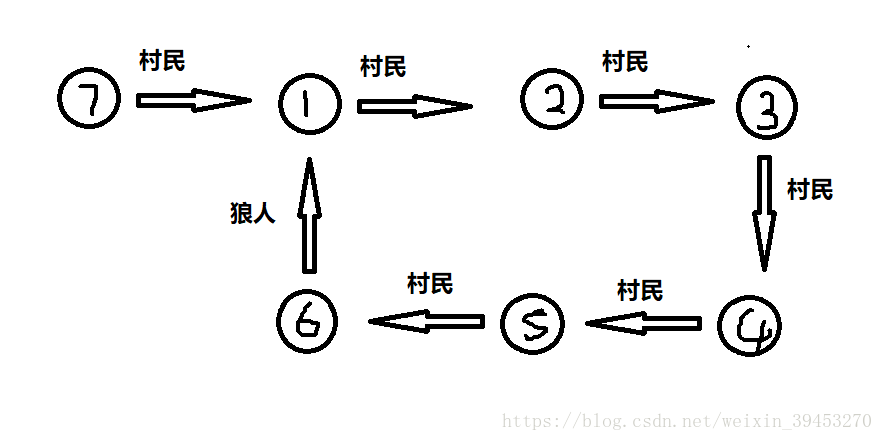

# Werewolf（并查集）

### 题目链接：[HDU - 6370](https://vjudge.net/problem/1767887/origin) 

### 题目大意：现在有N 个人，每个人有两种可能；一种是  村民：他一定说真话；另一种是  狼   ：他有可能说真话，也有可能说假话；		

### 问：有多少确定的  村民  ，狼；

### 解题思路：

#### 很神奇的想法，说实话我想不到：

 

如图形成1.2.3.4.5.6这样的环 的话，其中只有一条边是狼，其他的边都是村民，那么，1号肯定肯定是一头铁狼；(不相信的话自己推一遍)，暂且称作为“狼环”；

如果 1号是狼的话：那么说1号是村民的人都是狼；

根据这个条件，可以判断  必定是狼的数目是多少；

但是   村民的人是不确定的；所以必定是村民的数量是 0；

思路确定了，讨论一下写法：可以用并查集，

因为一个人只能说一次，所以当一个人说另外一个人是村民是，那他们两个是一组的；一个人说另外一个人是狼是，那么把另外一个人标记上一下，他们两不放到一个组；当一个人说另外一个人是狼的时候，他们两还在一个组里说明形成了"狼环"(关键点)，狼就是这个被标记的人；

再利用一个 vector 把说这只狼是  村民的存下来 最后利用dfs的方式算出狼的数量；

### 代码：


```c++
#include<bits/stdc++.h>
#define ll long long
using namespace std;
struct node{
	bool w;
	int  id;
}a[100100];	//每个人所说的信息

int f[100100];//并查集中的父亲
vector<int> vill[100100];//vill[i] 中存储的是说 i 是村民的id;
int v[100100];	//dfs 时 所用到的 标记
int ans;	//狼的数量
int Find(int x)
{
	if(f[x] == x)
	return x;
	
	return f[x] = Find(f[x]); 
}

void Unite(int x,int y)
{
	int fx = Find(x);
	int fy = Find(y);
	
	if(fx == fy)
	return;
	
	f[fx] = fy; 
}

void dfs(int x)
{
	int num = vill[x].size();
	
	for(int i=0; i<num; i++)
	{
		if(v[vill[x][i]])
		continue;
		v[vill[x][i]] = 1;
		ans++;
		dfs(vill[x][i]);
	}
}

int main()
{
	int T;
	scanf("%d",&T);
	
	while(T--)
	{
		int n;
		scanf("%d",&n);
		
		for(int i=1;i<=n;i++)
		{
			f[i] = i;
			vill[i].clear();
			a[i].w = 0;
		}
		memset(v,0,sizeof(v));
		
		for(int i=1;i<=n;i++)
		{
			int x;
			char s[20];
			
			scanf("%d %s",&x,s);
			
			a[i].id = x;
			if(s[0] == 'w')
			{
				a[i].w = 1;
			}
			else
			{
				Unite(x,i);
				vill[x].push_back(i);
			//	a[i].w = 0;
			}
		 } 
		 ans = 0;
		 for(int i=1; i<=n; i++)
		 {
		 	if(a[i].w&& Find(i) == Find(a[i].id))
		 	{
		 		v[a[i].id] = 1;
		 		
		 		ans++;
		 		dfs(a[i].id);
		 		
			 }
		 }
		printf("0 %d\n",ans);		
	}

}

```


######  大佬的思路就是厉害