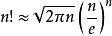

# 输入N求N的阶乘的10进制表示的长度 

### 题目链接：https://www.51nod.com/onlineJudge/questionCode.html#!problemId=1058

### 思路：斯特林公式：


  

再用log10（sum）算出sum的长度；

### 代码：

```c++
#include<stdio.h>
#include<iostream>
#include<cmath>
using namespace std;

int main()
{

	long long n;
	cin>>n;
	if(n==1)
	printf("1\n");
	else
	printf("%lld\n",(long long)((log10(sqrt(4.0*acos(0.0)*n))+n*(log10(n)-log10(exp(1.0))))+1));

	
	 
	

	return 0;
}
```

